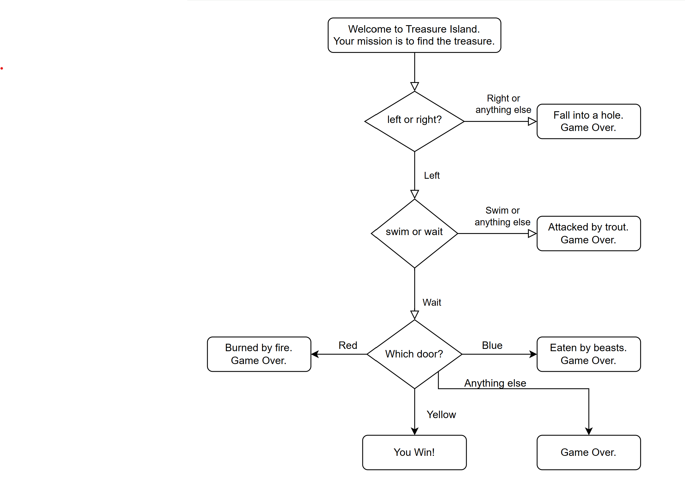

## Control Flow and Logical Operators
### Conditional Operators 
**if/else condition**
````
print("Welcome to the rollercoaster!")
height = int(input("What is your height in cm? "))
if height >=120:
        print("You are allowed to enter the ride")
else:
        print("Not allowed to issue the ticket!! Sorry!")
````
**Comparator Operators**
````
> Greater than
< Less than
>= Greater than or equal to
<= Less than or equal to
== Equal to
!= Not equal to
````
**Modulo(%) operator** <br> The modulo operator gives you the remainder of a division.
````
number=int(input("Enter the number to check: "))
if number % 2 ==0:
        print("Entered number is even")
else:
        print("Entered number is odd")
````
**Nested elif** <br> You can put if/else statements inside other if/else statements. This is known as nesting.
````
print("Welcome to the rollercoaster!")
height = int(input("What is your height in cm? "))
if height >= 120:
    print("You can ride the rollercoaster")
    age = int(input("What is your age?"))
    if age <= 12:
        print("Please pay $5")
    elif age <= 18:
        print("Please pay $7")
    else:
        print("Please pay $12")
else:
    print("Sorry you have to grow taller before you can ride.")
````
**Multiple ifs**
````
print("Welcome to the rollercoaster!")
height = int(input("What is your height in cm? "))

if height >= 120:
    print("You can ride the rollercoaster")
    age = int(input("What is your age? "))
    if age <= 12:
        bill = 5
        print("Please pay $5.")
    elif age <= 18:
        bill = 7
        print("Please pay $7.")
    else:
        bill = 12
        print("Please pay $12.")
    capture_photo=str(input("Do you want to capture picture?"))
    if capture_photo == "y":
        bill+=3
    print(f"your final bill is {bill}")
else:
    print("Sorry you have to grow taller before you can ride.")
````
**PIZZA python program** --> refer **Pizza order.py**

**Logical Operators** -->refer **logicalOperator.py** <br>
You can combine different conditions using logical operators.<br>
A and B #Both conditions need to be true <br>
C or D #Only one condition needs to be true <br>
not E #The condition must be false<br>

## Treasure Island project
**Flow Diagram**
