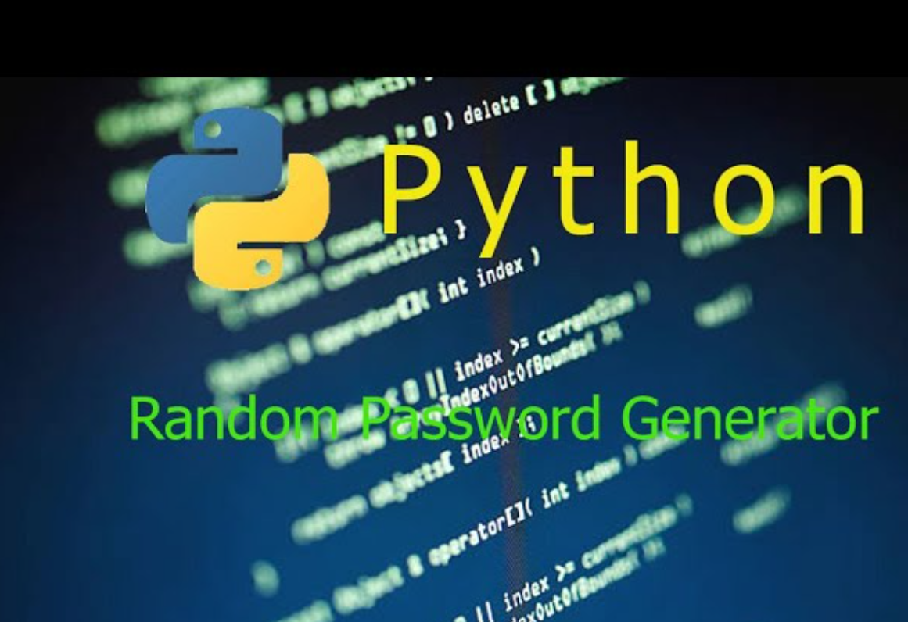

## Loops, ranges and codes
#### Loops are very important in programming languages.
**for() loop** <br>
````
fruits = ["Apple", "Peach", "Pear"]
fruits.append("banana")
for fruit in fruits:
    print(fruit)
    print(fruit + " pie")
````
#### Highest score program. Refer HighScore.py

### for loop() with range. Refer fizzy.py
````
total=0
for number in range(1,101):
    total +=number
print(total)
````
### Password Generator Project. Refer password generator project.py

